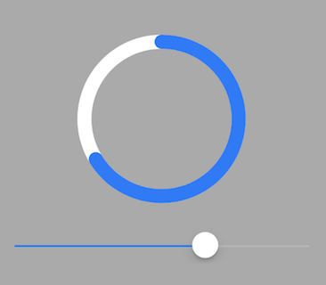

# CircularProgressView

A circular progress view for iOS implemented in Swift.



# Features

* Resizes proportionally and centers to fit view
* Customize the track's and progress's colors
* Customize the track's line width

# Installation

- Manual
  - Add CircularProgressView.swift in target
- Carthage
  - Add `github "chrisamanse/CircularProgressView"` in Cartfile

# Usage

## Programmatically

```swift
let rectProgressView = CGRect(x: 40, y: 40, width: 100, height: 100)
let progressView = CircularProgressView(frame: rectProgressView)
progressView.progress = 0.67
view.addSubview(progressView)
```

### View properties

```swift
progressView.trackLineWidth = 4.0
progressView.trackTintColor = UIColor.lightGrayColor()
progressView.progressTintColor = UIColor.darkGrayColor()
progressView.roundedProgressLineCap = true
```

## Interface Builder

Use UIView subclass `CircularProgressView` on a UIView in Interface Builder. Enter `CircularProgressView` as module if it is from the framework. Its properties can also be changed in Interface Builder.

## License

Copyright (c) 2018 Joe Christopher Paul Amanse. This software is distributed under the [MIT License](./LICENSE.md)
